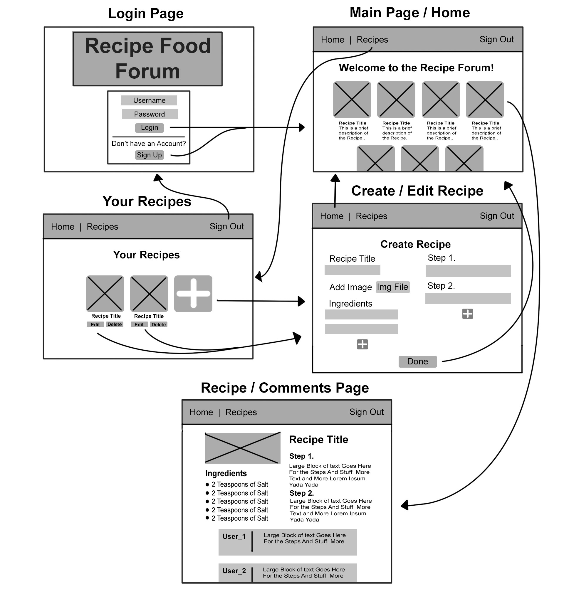

# Recipe-Forum

## Description
- A Recipe-Forum app that is a place meant to give food lovers a place to come together and share their favorite recipes and comment on recipes. plus testing

## Wireframe

## ERD

## [Trello-Board](https://trello.com/b/Xl8J8a75/food-forum-app)

## MVP
- As a user, I want to view all recipes
- As a user, I want to view a single recipe
- As a user, I want to create a recipe with a name and description
- As a user, I want to be able to edit a recipes name and description
- As a user, I want to delete a recipe
- As a user, I want to be able to sign-in
- As a user, I want to be able to sign-up
- As a user, I want to be able to sign-out
- As a user, I want to be able comment on a recipe

## Version 2
- As a user, I want to be able to like a recipe
- As a user, I want to be able to dislike a recipe 

## Version 3
- Add Images to the Recipe

## Technologies Used
1. Javascript
2. HTML
3. CSS
4. Django
5. Postgresql
6. Cors
7. Django-auth
8. Node
9. REACT