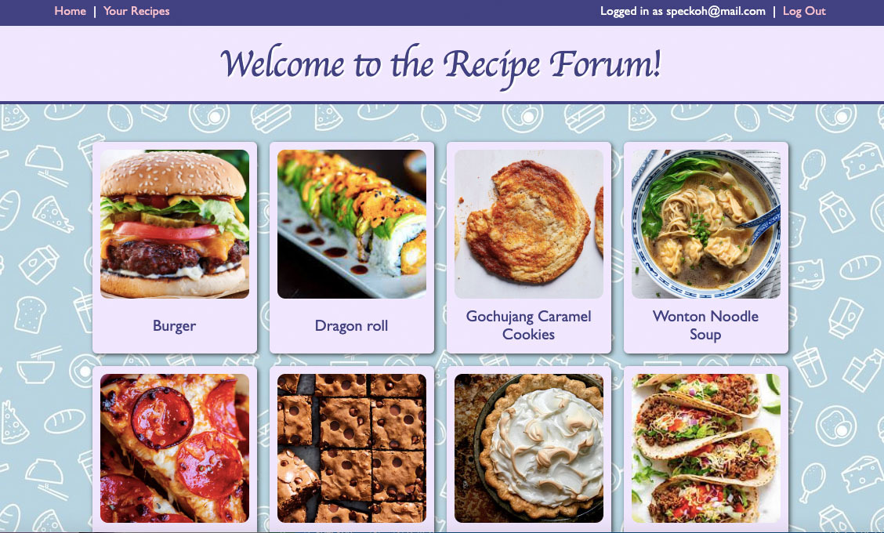
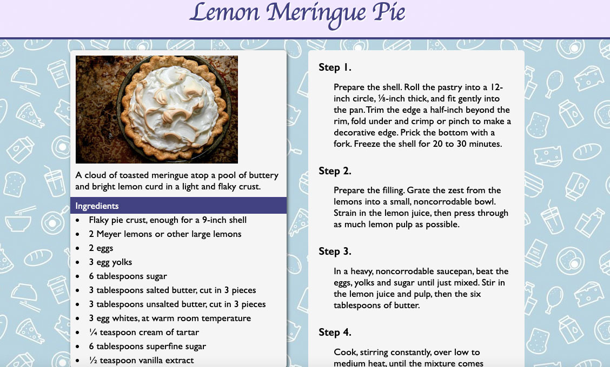
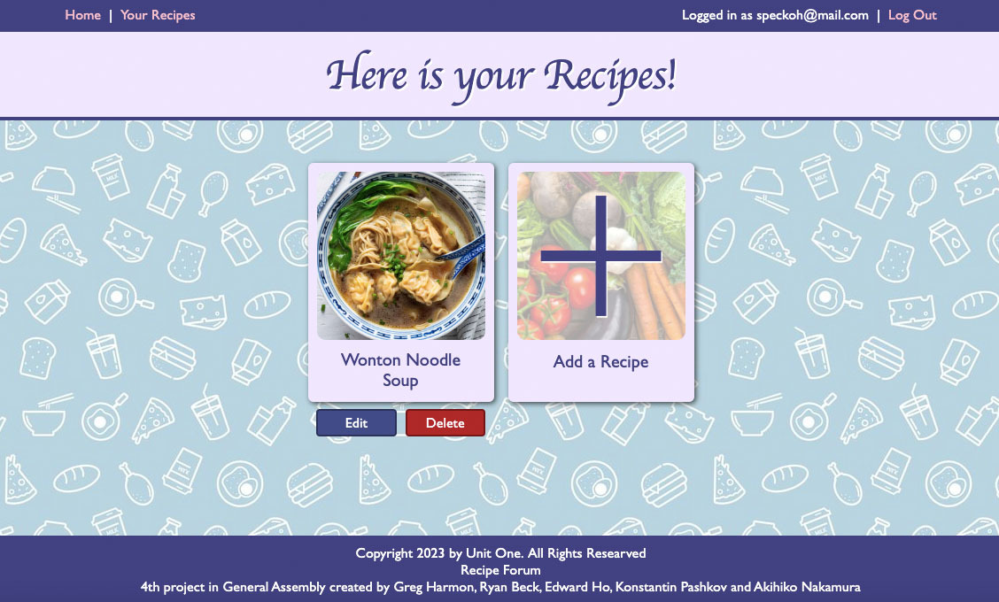
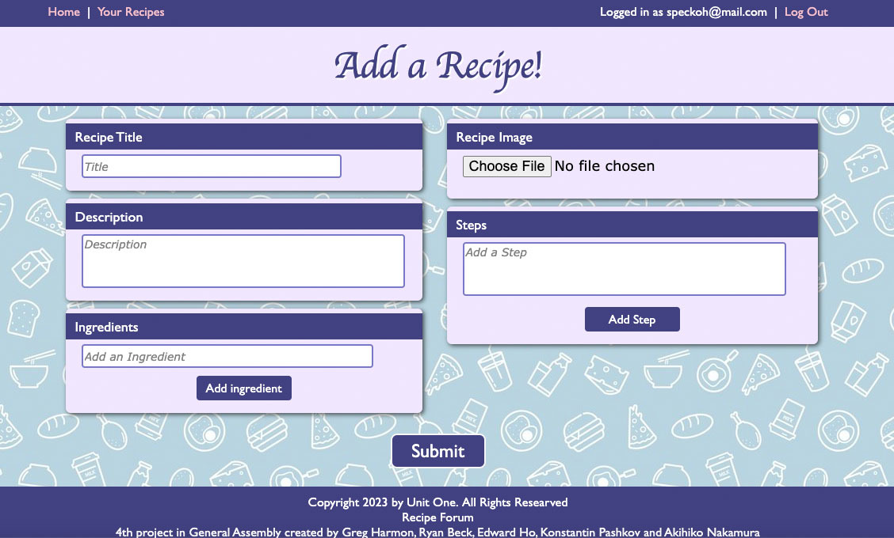

# Recipe-Forum

## Description
A Recipe-Forum app that is a place meant to give food lovers a place to come together and share their favorite recipes and comment on recipes. Check out our app [HERE](https://recipe-forum-client.onrender.com/main)

## Screen Shots

## [Trello-Board](https://trello.com/b/Xl8J8a75/food-forum-app)

## Version 2
- As a user, I want to be able to like a recipe
- As a user, I want to be able to dislike a recipe 

## Version 3
- As a user, I want to add user avatars 
- As a user, I want to be able to comment with Emojis
- As a user, I want to be able to search recipes

## Technologies Used
1. Javascript
2. HTML
3. CSS
4. Django
5. Postgresql
6. Cors
7. Django-auth
8. Node
9. REACT
10. Python
11. Cloudinary